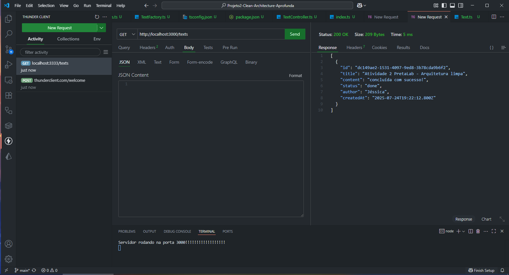
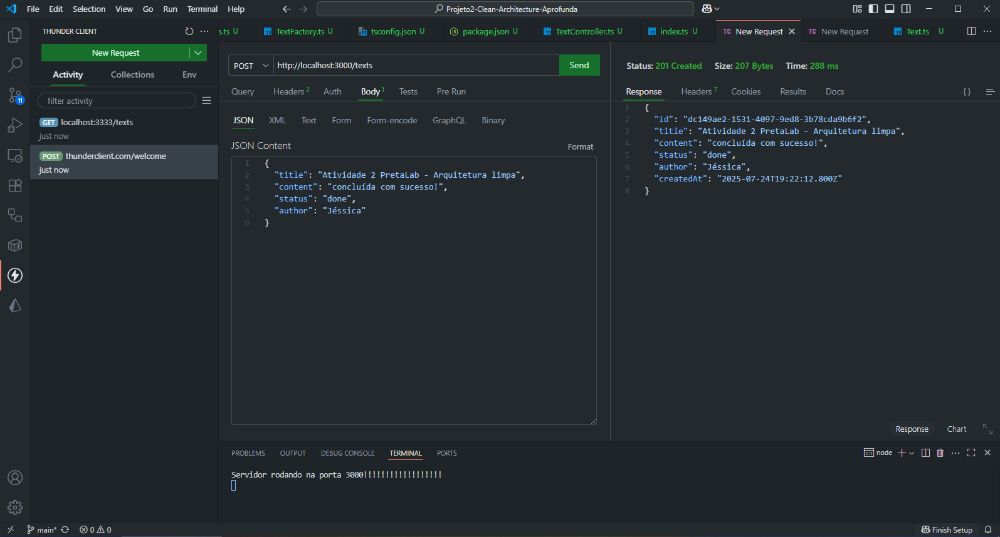
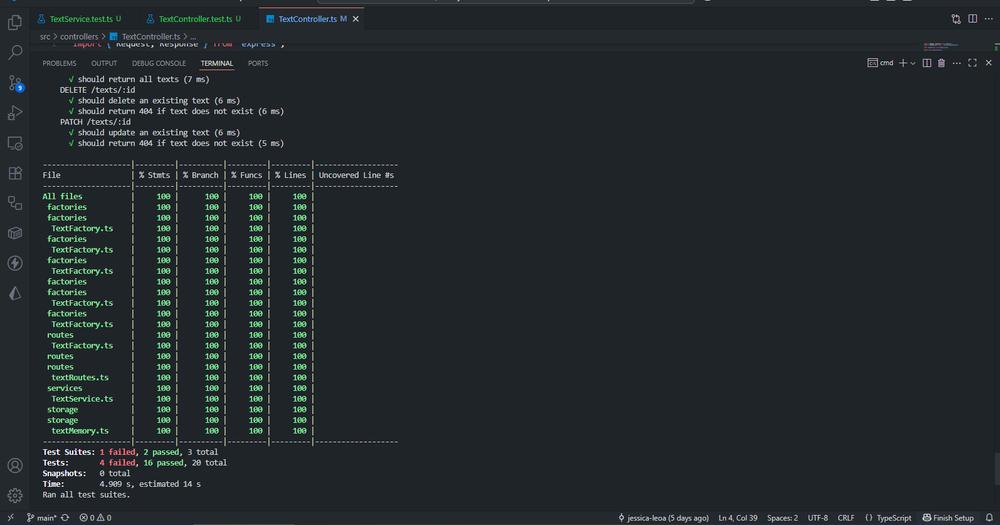

# 📚 Projeto2-Clean-Architecture-Aprofunda: API de Gerenciamento de Textos

## 🚀 Tecnologias Utilizadas

* Node.js
* TypeScript
* Express
* UUID
* Cors

## ⚙️ Como rodar o projeto

1. **Clone o repositório**

   ```bash
   git clone https://github.com/jessica-leoa/Projeto2-Clean-Architecture-Aprofunda.git
   ```

2. **Acesse a pasta do projeto**

   ```bash
   cd nome-do-repositorio
   ```

3. **Instale as dependências**

   ```bash
   npm install
   ```

4. **Inicie o servidor**

   ```bash
   npm run dev
   ```

5. O servidor estará rodando em:

   ```
   http://localhost:3000
   ```

## 🧪 Como testar as rotas (Postman ou Thunder Client)

### 🔸 Criar um texto (POST)

* **Rota:** `http://localhost:3000/texts`
* **Método:** POST
* **Body (JSON):**

  ```json
  {
    "title": "Meu primeiro texto",
    "content": "Este é o conteúdo do texto.",
    "status": "draft",
    "author": "seu nome"
  }
  ```

### 🔸 Listar todos os textos (GET)

* **Rota:** `http://localhost:3000/texts`
* **Método:** GET

## 🎯 Objetivo da API

Esta API tem como objetivo gerenciar textos criados por usuários. Ela permite o cadastro de textos com título, conteúdo, status e autor, além de possibilitar a listagem de todos os textos cadastrados. Ideal para projetos iniciais de estudo com foco em back-end, CRUD e organização de código em camadas (MVC + Services + Factory + Memory Storage).

---

Se quiser, posso criar e salvar esse `README.md` para você! Deseja?

Método GET:



Método POST:



Teste com Jest e Supertest


